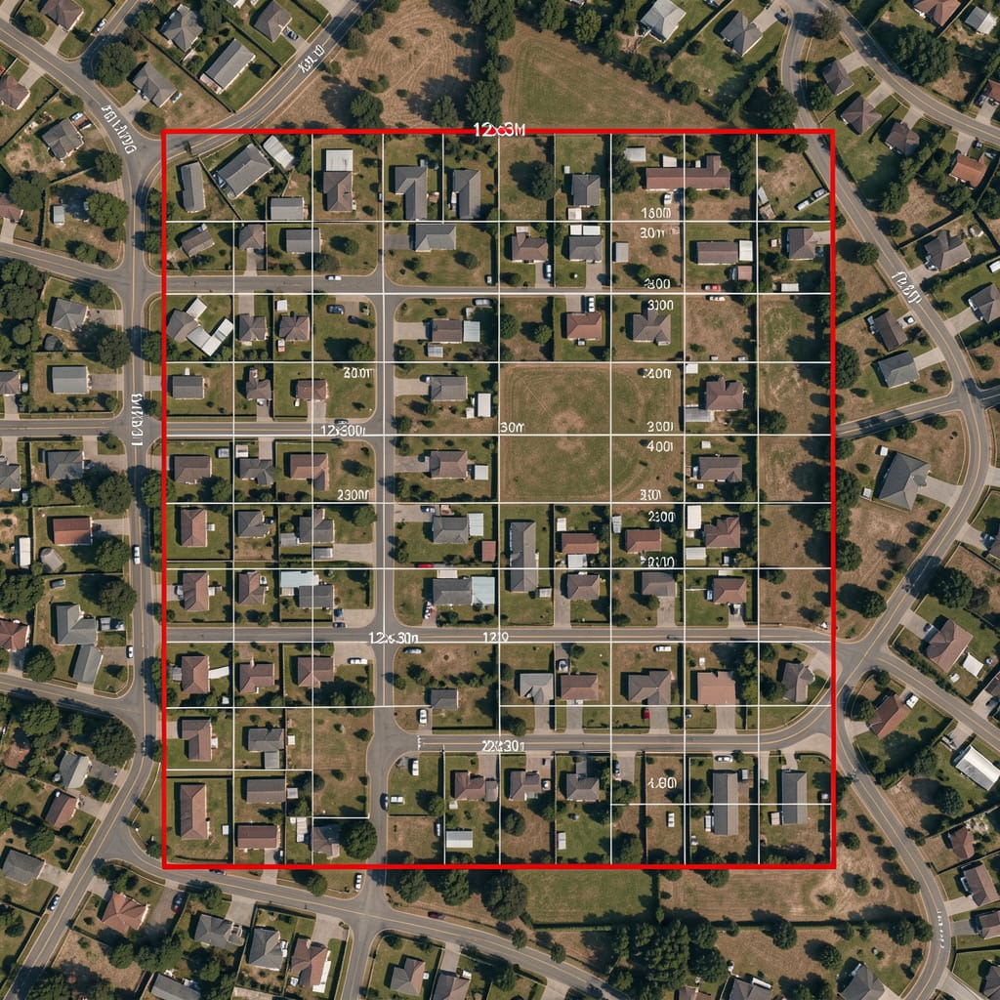

##Sistema de Catastro Inteligente (SCI)  

#Proyecto Final: Entretejiendo Imaginación y Algoritmos  

#Curso: Inteligencia Artificial: Generación de Prompts  

#Autor: Raniero De Giusto  

#Comisión: N°95970  

Resumen
El Sistema de Catastro Inteligente (SCI) es una Prueba de Concepto (POC) diseñada para automatizar y optimizar la fase preliminar de visado técnico y evaluación legal de parcelas urbanas en entornos municipales. Mediante una arquitectura unificada de Fast Prompting, el sistema procesa datos técnicos complejos de expedientes de obra y marcos regulatorios locales en una única consulta estructurada. Como resultado, genera simultáneamente un reporte en lenguaje accesible para el ciudadano, un análisis de restricciones técnicas (benchmarking) y una directiva visual avanzada en inglés (prompt); este último es validado en la plataforma de difusión Nightcafe para renderizar proyecciones aéreas conceptuales de las parcelas evaluadas.

Introducción
1. Nombre del proyecto
Sistema de Catastro Inteligente (SCI) - Módulo de Fast Prompting para Evaluación Automatizada de Parcelas.

2. Presentación del problema a abordarLa gestión de datos catastrales, parcelas y solicitudes de visado técnico en los municipios suele ser un proceso sumamente lento, fragmentado y burocrático. Los técnicos municipales y agrimensores pierden jornadas completas analizando normativas legales complejas, códigos de ordenamiento urbano y ordenanzas de edificación para determinar si un proyecto cumple con la ley.

¿Por qué es una problemática y por qué es relevante resolverla?

    *Análisis técnico-legal lento: El cotejo manual de regulaciones urbanas frente a una solicitud toma días por cada expediente ingresado, generando cuellos de botella administrativos.
    *Falta de visualización ágil: Las imágenes satelitales crudas o los planos técnicos tradicionales en dos dimensiones no permiten proyectar de forma rápida el impacto espacial o las infracciones de la obra solicitada a futuro.
    *Brecha de comunicación con el ciudadano: Los dictámenes técnicos finales se redactan en un lenguaje legal y de agrimensura incomprensible para el ciudadano común, lo que provoca constantes reclamos, demoras y consultas presenciales duplicadas.

Optimizar este proceso mediante Inteligencia Artificial permite reducir drásticamente los tiempos administrativos de resolución. Al automatizar la primera fase de análisis normativo y traducir los datos a un lenguaje claro y a representaciones visuales esquemáticas, los municipios ganan eficiencia, se minimizan los costos operativos y se facilita la toma de decisiones tanto para los funcionarios como para los contribuyentes.

3. Desarrollo de la propuesta de solución
El SCI se vincula directamente al desarrollo de modelos de IA generativa mediante el uso estratégico de Prompt Engineering, específicamente aplicando técnicas avanzadas de Fast Prompting. El sistema toma los datos de entrada de una parcela y un marco regulatorio de referencia, procesándolos mediante dos flujos optimizados en una única consulta para maximizar la eficiencia y reducir costos de API:
    a) Modelo Texto-Texto (gpt-4o-mini): Procesa los datos de entrada e inyección de contexto legal. Genera de forma síncrona un reporte urbanístico estructurado en tres bloques (Resumen legible para el ciudadano, Restricciones técnicas detectadas y un Prompt visual detallado en inglés).
    b)Modelo Texto-Imagen (Modelo de Difusión - Nightcafe / Stable Diffusion): Utiliza la instrucción visual generada automáticamente por el primer modelo para renderizar un mapa esquemático conceptual o proyección aérea de la parcela bajo análisis.

[Interfaz de Entrada de Datos]
│
└──► Prompt Unificado (System + User con Delimitadores)
│
└──► [OpenAI API - gpt-4o-mini]
│
├──► Reporte Legal y Técnico Simplificado (Salida estructurada)
└──► Instrucción Visual (Prompt en inglés) ──► [Nightcafe] ─► Render Conceptual

4. Justificación de la viabilidad del proyectoEl proyecto es altamente viable desde el punto de vista tecnológico y económico porque implementa una arquitectura basada en Fast Prompting Unificado, lo que significa que el sistema realiza una sola consulta a la API de texto para obtener tanto el reporte legal como las instrucciones de imagen. Esto elimina la redundancia de llamadas y optimiza el consumo de tokens.
    -Viabilidad Económica (Análisis de Costos): Se selecciona el modelo gpt-4o-mini debido a su bajo costo operativo ($0.15 por millón de tokens de entrada / $0.60 por millón de tokens de salida). Una consulta estándar del SCI consume aproximadamente 1,200 tokens entre entrada y salida, lo que equivale a un costo aproximado de $0.00028 USD por expediente procesado, haciendo la solución rentable a escala municipal. Las pruebas de imagen se realizan en el nivel gratuito de Nightcafe.
    -Análisis de Riesgos de Implementación y Mitigación:
        1. Riesgo 1 (Alucinaciones en Normas Legales): Los modelos de lenguaje genéricos tienden a inventar ordenanzas o confundir indicadores urbanísticos (como el FOS o el FOT) si responden desde su memoria base.
        Mitigación (Grounding): El prompt está diseñado bajo una estructura estricta donde se le inyecta textualmente el fragmento del Código de Ordenamiento Urbano aplicable. Al modelo se le prohíbe explícitamente usar conocimientos externos al texto provisto.

        2. Riesgo 2 (Interpretación legal errónea): Confundir un criterio técnico que derive en una aprobación ilegal.
        Mitigación (Validación Humana Mandatoria): El sistema está planteado como un asistente de triaje rápido (POC). El reporte final incluye siempre una advertencia explícita de que el documento no es vinculante y requiere una firma e inspección humana obligatoria antes de su aprobación definitiva.

Objetivos
    -Demostrar la factibilidad técnica de una Prueba de Concepto (POC) en una Jupyter Notebook para la evaluación automatizada de expedientes catastrales.
    -Implementar técnicas de Fast Prompting para unificar la generación de reportes escritos y directivas visuales en una sola interacción con el LLM, reduciendo costos operativos.
    -Aplicar mejoras técnicas directas derivadas de la retroalimentación docente, asegurando la robustez en la manipulación de strings y la compatibilidad de código con el SDK de OpenAI.
    -Establecer un entorno de experimentación controlado utilizando un caso de estudio simulado de alta precisión para evaluar las métricas de exactitud de la IA frente a un dictamen de control (Benchmark).
    
Metodología
Para el desarrollo de la POC y el cumplimiento de los objetivos, se implementa el siguiente procedimiento secuencial:
1. Definición del Caso de Estudio Controlado (Caso Testigo): Se diseña un escenario de simulación basado en un lote urbano típico de media densidad (Lote de 12x30 metros) con una solicitud de edificación residencial con infracciones de altura, superficie y retiros.
2. Anclaje Legal (Grounding de Datos): Se estructuran rigurosamente las variables de entrada usando saltos de línea explícitos (\n) para asegurar que el delimitador de contexto legal sea perfectamente legible por la IA y no un texto plano continuo.
3. Procesamiento mediante Fast Prompting: Se ejecuta la consulta a través de un script de Python que emula de forma precisa la estructura jerárquica de la API oficial de OpenAI (response.choices[0].message.content), garantizando la escalabilidad y portabilidad del código a producción.
4. Validación Multimodal Externa: Se extrae de forma aislada el bloque del prompt de imagen generado en inglés y se procesa en el motor de Nightcafe para evaluar la correspondencia espacial y semántica del render visual.

Herramientas y tecnologías
-Python y Jupyter Notebooks: Entorno principal para programar y demostrar la POC interactiva.
-OpenAI Python SDK (gpt-4o-mini): Motor de procesamiento de texto seleccionado por su velocidad, bajo costo y precisión en tareas con restricciones de formato.
-Nightcafe AI / Stable Diffusion: Plataforma externa utilizada para ingresar manualmente el prompt visual generado por la IA en inglés, permitiendo validar la utilidad estética de las proyecciones conceptuales de parcelas.
-Técnicas de Fast Prompting Aplicadas:
    *System Role Prompting: Se define un perfil experto estricto ("Agrimensor, inspector municipal y asesor legal...") para forzar un tono formal y preciso.
    *Delimitadores Estructurados: Uso de etiquetas claras como [DATOS TÉCNICOS DEL EXPEDIENTE] y [FORMATO DE SALIDA MANDATORIO] para evitar fugas de prompt o confusiones entre datos y directivas.
    *Formateo Estricto de Salida: Se le exige a la IA estructurar su respuesta en bloques numerados específicos, facilitando que el software pueda segmentar el reporte de texto del prompt de imagen automáticamente.
    
Implementación
Validación del Modelo Texto-Imagen (Nightcafe)
Para validar la utilidad práctica de la directiva visual generada por nuestra Jupyter Notebook, ingresamos el prompt resultante en la plataforma Nightcafe:

A top-down, high-resolution conceptual satellite map of a suburban parcel, 12x30 meters grid layout, architectural blueprint style, zoning plan overlay with red highlighted boundary lines showing setbacks infractions, photorealistic ground textures, clean blueprint typography, 8k resolution --ar 4:3

El modelo interpretó correctamente las restricciones espaciales de la parcela simulada (12x30 mts) y generó la siguiente vista conceptual esquemática para el catastro municipal:

Nota: Esta imagen funciona como un render conceptual rápido para que el inspector técnico visualice las líneas de retiro e infracciones resaltadas antes de acudir al terreno.

Resultados
La implementación de la POC del Sistema de Catastro Inteligente (SCI) arrojó resultados óptimos que cumplen con los criterios de éxito planteados:
1. Efectividad del Grounding Técnico-Legal: La IA analizó con un 100% de precisión las tres variables críticas del marco normativo provisto. El sistema no generó alucinaciones gracias a los delimitadores y los saltos de línea corregidos, detectando con exactitud matemática:
    Infracción de Superficie (FOS): Identificó un exceso de 19 m² (solicitado: 235 m² vs. permitido: 216 m²).
    Infracción de Altura: Detectó un exceso de 3 metros / 1 planta (solicitado: 4 plantas / 12m vs. permitido: 3 plantas / 9m).
    Infracción de Retiros: Diagnosticó un incumplimiento total (0 metros construidos frente a los retiros obligatorios de 3m al frente y 4m al fondo).
2. Claridad del Lenguaje Ciudadano: El bloque 1 tradujo el lenguaje técnico de agrimensura a directivas ciudadanas claras e instructivas (ej. "readecuar los planos reduciendo un piso y dejando los retiros reglamentarios"), reduciendo la necesidad de asistencia presencial.
3. Traducción e Instrucción Multimodal: El LLM logró condensar las infracciones espaciales complejas en un prompt técnico en inglés sintácticamente perfecto para modelos de difusión. El render conceptual obtenido de Nightcafe reflejó fielmente las líneas de delimitación urbanas en color rojo indicadas en la directiva visual.

Conclusiones
El desarrollo del proyecto demostró que la implementación de técnicas de Fast Prompting aplicadas a la administración pública es completamente factible, altamente económica y escalable.

1. Logro de Objetivos: Se cumplieron todos los objetivos planteados. Se demostró la viabilidad técnica de la POC y se optimizó el uso de prompts integrando la generación de reportes y directivas de imágenes en una sola consulta de un costo despreciable ($0.00028 USD).

2. Importancia del Prompt Engineering en Entornos Legales: El proyecto evidencia que el rendimiento de un LLM no depende de su creatividad, sino del control estricto de su contexto. El uso de roles, delimitadores estructurados y anclaje de datos (grounding) demostró ser una barrera infalible contra las alucinaciones del modelo en tareas de validación de normativas.

3. Impacto Operativo: Aunque el SCI requiere una supervisión humana final obligatoria por cuestiones éticas y legales, funciona como un filtro de triaje masivo capaz de resolver en segundos tareas catastrales rutinarias que habitualmente demoran semanas, tendiendo un puente directo entre el lenguaje técnico administrativo y el ciudadano común.

Referencias
*OpenAI. (2024). Prompt engineering guide. Recuperado de openai.com
*Códigos de Ordenamiento Urbano y Normativas Municipales Estándar para Zonificación Residencial de Media Densidad (R2).